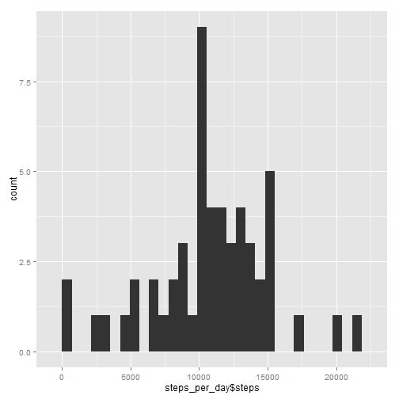

## Loading and preprocessing the data

```r
if (!require("ggplot2")) {
  install.packages("ggplot2")
  library("ggplot2")
}

if (!require("plyr")) {
  install.packages("plyr")
  library("plyr")
}

if (!require("reshape")) {
  install.packages("reshape")
  library("reshape")
}

if (!require("lubridate")) {
  install.packages("lubridate")
  library("lubridate")
}

activity <- read.csv(unz("activity.zip", "activity.csv"))

activityNoNA <- activity[!is.na(activity$steps), ]
```


## What is mean total number of steps taken per day?


```r
steps_per_day <- ddply(activityNoNA, .(date), summarise, steps = sum(steps))

mean_steps_per_day <- mean(steps_per_day$steps)
median_steps_per_day <- median(steps_per_day$steps)

qplot(steps_per_day$steps)
```

```
## stat_bin: binwidth defaulted to range/30. Use 'binwidth = x' to adjust this.
```

 

Mean number of steps: 1.0766189 &times; 10<sup>4</sup>

Median number of steps: 10765


## What is the average daily activity pattern?


```r
mean_steps_per_interval <- ddply(activityNoNA, c("interval"), summarise, steps = mean(steps))
max_steps_per_interval <- mean_steps_per_interval[mean_steps_per_interval$steps == max(mean_steps_per_interval$steps),]

ggplot(mean_steps_per_interval, aes(x=interval, y=steps)) + geom_line()
```

 

5-minute Inverval with Average Maximum Steps (Interval averaged over all days with a reading for that interval): 
835

## Imputing missing values


```r
na_index <- which(is.na(activity$steps))
```

The total number of missing values in this dataset is: 2304


```r
imputed_values <- as.numeric(lapply(na_index, function(x) {
  inter <- activity[x,]$interval
  mean_steps_per_interval[mean_steps_per_interval$interval == inter,]$steps 
}))

activityNaImput <- activity
activityNaImput[na_index, ]$steps <- imputed_values

steps_per_day <- ddply(activityNaImput, .(date), summarise, steps = sum(steps))

mean_steps_per_day <- mean(steps_per_day$steps)
median_steps_per_day <- median(steps_per_day$steps)

qplot(steps_per_day$steps)
```

```
## stat_bin: binwidth defaulted to range/30. Use 'binwidth = x' to adjust this.
```

 

Mean number of steps: 1.0766189 &times; 10<sup>4</sup>

Median number of steps: 1.0766189 &times; 10<sup>4</sup>

Replacing the missing values with the average value for that interval instead of simply omitting those entries has not measurably impacted this analysis.

## Are there differences in activity patterns between weekdays and weekends?


```r
weekend_index <- which(weekdays(ymd(activityNaImput$date)) %in% c("Saturday", "Sunday"))

weekend_activity <- activityNaImput[weekend_index, ]
weekday_activity <- activityNaImput[-weekend_index, ]

weekend_mean_steps_per_interval <- ddply(weekend_activity, c("interval"), summarise, steps = mean(steps))
weekday_mean_steps_per_interval <- ddply(weekday_activity, c("interval"), summarise, steps = mean(steps))

alldays_mean_steps_per_interval <- data.frame(weekend_mean_steps_per_interval$interval, 
                                              weekend_mean_steps_per_interval$steps, 
                                              weekday_mean_steps_per_interval$steps)
names(alldays_mean_steps_per_interval) <- c("Interval", "Weekend_Steps", "Weekday_Steps")

plot_data <- melt(alldays_mean_steps_per_interval, id=c("Interval"))
names(plot_data) <- c("Interval", "Day_Type", "Steps")

ggplot(plot_data, aes(Interval, Steps)) + geom_line(color="blue") + facet_wrap(~Day_Type, ncol=1)
```

 


